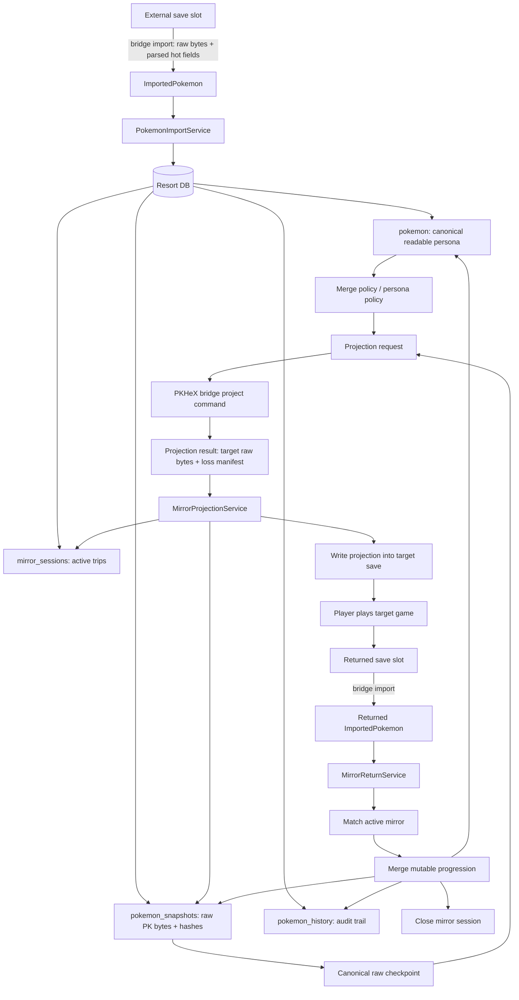

# Mirror Projection Architecture

This document is the design target for making Pokemon Resort behave like canonical storage while allowing Pokemon to travel to any supported game. It is intentionally policy-heavy: PKHeX can do format work, but the product promise is ours.

## Product Promise

Pokemon Resort is the source of truth. A Pokemon placed in Resort should keep its identity, history, and highest-fidelity data in Resort. Games receive playable mirrors/projections. When a mirror returns, Resort adopts legitimate progression and restores anything the target game could not represent.

The user-facing rule is:

> This mirror may not carry every detail into the target game. Resort keeps the full Pokemon safe and restores missing information when it comes back.

The visibility rule is stricter:

> Only one visible instance of a Pokemon exists to the player. If the Pokemon is in a game, it is not in a Resort box. If it is in a Resort box, it is not in a game.

For now, a Pokemon that is away in another game has **no player-facing UI in Resort**. It is not blocked, ghosted, dimmed, or shown in an "away" list. It is hidden in backend-only off-Pokemon storage until it returns. Future UI such as passports/travel records may expose away Pokemon intentionally, but that is not part of the current transfer UX.

## Current Codebase Baseline

Already implemented:

- `PokemonResortService::importParsedPokemon` persists imported Pokemon into canonical Resort storage.
- `pokemon` stores normalized hot fields used by Resort UI and merge policy.
- `pokemon_snapshots` stores raw PKM bytes, format, game id, hash, parsed JSON, and notes.
- `pokemon_history` records created/imported/merged/moved/exported-style events.
- `mirror_sessions` and `MirrorSessionService` exist for active/returned/lost/abandoned mirror state.
- `PokemonMatcher` can match returned imports to active mirror sessions using beacon/progression checks.
- `PokemonExportService` can produce export projections and open mirror-session-shaped output, but the player-facing full mirror lifecycle is not complete.
- Same-game Resort-to-game export can reuse the latest compatible raw snapshot payload instead of synthetic projection bytes.
- Same-game return imports can attach generic exact-identity matches to an active mirror session and close that session after merge.
- The transfer screen can attach exported raw snapshot bytes to a game slot as a mirror payload, so real save write-back has PKM bytes for Resort-origin Pokemon.
- The native app keeps PKHeX behind the process bridge in `tools/pkhex_bridge`.
- The bridge `project` command contract/stub exists and validates request shape; `SaveBridgeClient` has typed parsing/client seams for project results.

Not yet implemented:

- PKHeX-backed bridge `project` conversion for arbitrary target-generation projections.
- A durable per-Pokemon canonical raw checkpoint separate from event snapshots.
- A field-level merge policy that understands every mutable category across generations.
- Player UI for lossy projection prompts, mirror send, mirror return, unboxed "away" state, and conflict review.
- Cross-generation projection and loss manifests backed by PKHeX conversion/fallback rules.

## Architecture Diagram



## Core Concepts

### Resort Persona

The Resort persona is the game-agnostic, player-facing identity and story layer for a Pokemon.

Owns:

- Display identity: nickname, species lineage, form where applicable, OT identity summary.
- Canonical progression summary: level, EXP, evolution state, moves, stats, EV/IV-style fields where representable.
- Story data: travel log, memories, achievements, ribbon/mark provenance, notable party/location events.
- Merge policy state: what changed, why it was accepted, what was restored from canonical data.

Does not own:

- Exact byte-level game representation.
- PKHeX legality semantics.
- Target-save slot writing.

### PK Snapshots And Canonical Raw

PK snapshots are the binary evidence. They are the bytes a game or PKHeX understands.

Required snapshot roles:

- `ImportedRaw`: first raw bytes from a game import.
- `CanonicalCheckpoint`: current highest-fidelity canonical bytes for this Pokemon.
- `MirrorProjection`: raw bytes sent to a target game.
- `MirrorReturnRaw`: raw bytes imported back from the target game.

Retention rule:

- Always keep first import and latest canonical checkpoint.
- Keep active mirror projection and return raw until the mirror is closed and audited.
- Keep bounded historical checkpoints for debugging and player trust. Do not store every generated projection forever unless the user explicitly exports/audits it.

### Mirrors

A mirror is not the canonical Pokemon. It is a target-game-compatible representation with a live session tying it back to the Resort Pokemon.

Mirror session stores:

- `pkrid`
- target game and target format
- status: active, returned, lost, abandoned
- sent species/form/lineage/level/EXP
- identity beacons usable by older games (TID/OT, optional slot metadata, generated marker where legal)
- projection JSON / loss manifest summary
- source canonical snapshot id used to create the mirror

Active mirror placement rule:

- A Pokemon with an active mirror is not placed in `box_slots`.
- Its old Resort slot is immediately free for any other Pokemon.
- Do not reserve, ghost, dim, block, or remember a return slot as gameplay state. Return placement is chosen when the player drags the returned Pokemon back into Resort.
- Do not render active-mirror Pokemon anywhere in Resort UI until a later explicit feature (for example passports/travel records) is designed.
- Backend storage for active-mirror Pokemon should be treated as an off-Pokemon container: safe, queryable by services, but not presentable to normal player UI.
- At most one active mirror may exist for a `pkrid`. Sending to another game must be rejected until the active mirror is returned, lost, or explicitly abandoned.

## Architectural Decisions

### AD-001: Resort is canonical; external saves are never canonical

All durable truth flows through Resort storage. External save data is imported as evidence, matched to a canonical Pokemon, then merged by policy. The UI must not treat an external save slot as the long-term owner of a Resort Pokemon.

### AD-002: Native code does not link PKHeX.Core

PKHeX remains behind the bridge process. Native code speaks JSON contracts through `SaveBridgeClient`-style functions.

Reason:

- Keeps native build/platform concerns separate from .NET/PKHeX.
- Makes bridge commands testable in .NET.
- Keeps conversion failures explicit at the process boundary.

### AD-003: Projection is allowed to be lossy, but canonical storage is not

Moving a Pokemon to an older game may lose representable data in the mirror. Resort must keep that data in canonical raw/persona state and restore it when the mirror returns.

### AD-004: Newer-format canonical raw is preferred, but not sufficient alone

The latest/highest-fidelity PK blob is the best binary base. It should be paired with a readable Resort persona and bounded snapshots. A single overwritten PK blob is not acceptable for "never lose data" because bad merges would be irreversible.

### AD-005: Field-level merge policy belongs in Resort services

PKHeX converts bytes and reports legality/fields. Resort decides which returned fields are mutable progression and which canonical fields must be preserved/restored.

### AD-006: Matching evolved returns must not depend on species equality

A returned mirror may evolve, change form, level up, change moves, earn ribbons, or alter other mutable fields. Matching must use mirror-session identity and beacons first, then compatibility checks, not exact species/form equality.

### AD-007: Every projection returns a loss manifest

Before writing a mirror to a save, the projection layer must report what cannot be represented in the target game. The UI prompt and merge policy both read this manifest.

### AD-008: Mega-scripts are prohibited

No one-off "convert everything" script should own the lifecycle. The lifecycle is split into bridge command, native bridge client, Resort services, repositories, and UI adapters.

### AD-009: Active mirrors are unboxed and exclusive

When a Pokemon is sent to a game, Resort keeps canonical data and snapshots but clears the Pokemon from Resort PC placement. This makes the box slot available immediately and preserves the one-visible-instance promise. A Pokemon cannot have two active mirrors in two different games.

Active mirrors are an **off-Pokemon backend state**, not a UI state. Normal Resort UI must discover Pokemon through presentable containers such as `box_slots`; it must not list active-mirror Pokemon from `pokemon` or `mirror_sessions`.

## Proposed Components

### Bridge: `project`

Location:

- `tools/pkhex_bridge/BridgeProject.cs`
- exposed through `BridgeConsole.cs` as `project`

Input JSON:

```json
{
  "bridge_project_schema": 1,
  "source_format_name": "PK7",
  "source_raw_payload_base64": "...",
  "source_raw_hash_sha256": "...",
  "target_game": 15,
  "target_format_name": "PK5",
  "projection_policy": {
    "allow_lossy_projection": true,
    "prefer_legal_moves": true,
    "preserve_resort_identity_beacon": true
  }
}
```

Output JSON:

```json
{
  "bridge_project_schema": 1,
  "success": true,
  "target_format_name": "PK5",
  "target_raw_payload_base64": "...",
  "target_raw_hash_sha256": "...",
  "legality": {
    "valid": true,
    "warnings": []
  },
  "loss_manifest": {
    "lossy": true,
    "lost_categories": ["memories", "marks", "modern_ribbons"],
    "projected_categories": ["species", "level", "moves", "held_item", "evs"],
    "notes": ["Target game cannot represent Gen 7 memories."]
  },
  "beacon": {
    "tid16": 8872,
    "ot_name": "MattiaP",
    "lineage_root_species": 121
  }
}
```

Bridge responsibilities:

- Decode source PK bytes.
- Let PKHeX attempt direct conversion where supported.
- For unsupported downgrades, create a target-format projection from allowed fields when policy permits.
- Validate target-format payload.
- Emit loss manifest and field report.
- Never mutate Resort DB directly.

### Native Bridge Client

Add a typed client near existing bridge launch logic:

- `SaveBridgeClient::projectPokemonWithBridge(...)`
- parses `BridgeProjectResult`
- validates base64/hash/format/loss manifest
- returns failure messages without UI-specific text

### Resort Services

#### `MirrorProjectionService`

Owns outbound mirror creation.

Responsibilities:

- Load canonical Pokemon and canonical raw checkpoint.
- Reject send if the Pokemon already has an active mirror.
- Create `ProjectionRequest`.
- Call bridge project client.
- Store `MirrorProjection` snapshot.
- Open `mirror_sessions` row.
- Clear the Pokemon from `box_slots` after the projection is successfully staged for write-back.
- Record history.
- Return `ProjectionResult` and prompt data to UI.

#### `MirrorReturnService`

Owns inbound mirror reconciliation.

Responsibilities:

- Import returned raw bytes.
- Find matching active mirror session.
- Compare returned fields against sent baseline and canonical state.
- Call merge policy.
- Store `MirrorReturnRaw` snapshot.
- Write new `CanonicalCheckpoint` snapshot if canonical bytes changed.
- Close mirror session returned.
- Place the Pokemon into the player-selected Resort slot using normal box placement policy.
- Record history and conflict/audit notes.

#### `PokemonMutableMergeService`

Pure policy service for field-level merge. It should not own SQL or bridge process calls.

Inputs:

- canonical persona
- canonical checkpoint parsed fields
- sent mirror field report
- returned imported fields
- loss manifest
- target game/generation rules

Outputs:

- accepted mutable changes
- rejected/suspicious changes
- canonical persona patch
- required PK checkpoint regeneration request

### Persistence

Existing tables can carry the first version, but the target model likely needs explicit additions:

- `pokemon_snapshots.kind`: add/standardize `CanonicalCheckpoint`, `MirrorProjection`, `MirrorReturnRaw`.
- `mirror_sessions`: add `source_snapshot_id`, `projection_snapshot_id`, `return_snapshot_id`, and `loss_manifest_json` if not encoded in `projection_json`.
- New optional table: `pokemon_persona_events`
  - `event_id`
  - `pkrid`
  - `event_type`
  - `game_id`
  - `location_id`
  - `timestamp`
  - `payload_json`
- New optional table: `pokemon_canonical_state`
  - one row per `pkrid`
  - `canonical_snapshot_id`
  - `canonical_format_name`
  - `canonical_game_id`
  - `updated_at`

Use repository classes for each table. Do not embed SQL in UI or bridge clients.

## Mutable Field Policy

The merge service should classify fields. This list is intentionally broader than the first implementation.

### Generally mutable and adoptable

- Level
- EXP
- Evolution/species along valid lineage
- Form, when target/game rules allow and lineage remains compatible
- Moves and PP/PP Ups
- Held item, subject to game availability and item identity mapping
- EVs / contest stats / training-derived stats
- IV-related changes only when the source game has a legitimate mechanic that can change them (for example hyper training style data in later games)
- Ribbons, marks, medals, memories, affection/friendship, contest achievements
- Pokerus/state flags where games legitimately mutate them
- Nickname, if the game allows rename and OT/rules permit
- Ball/met fields only when target game can legitimately change them, otherwise preserve canonical

### Usually identity/preserve fields

- `pkrid`
- lineage root species
- original canonical origin game
- original OT identity unless the game legitimately changes handler data instead
- stable PID/EC/home tracker style identifiers when present and meaningful
- first import snapshot and original raw bytes
- Resort-only story/memory data

### Suspicious changes requiring conflict handling

- Species changes outside allowed evolution/devolution/projection path.
- OT/TID/SID changes outside a known projection rule.
- Level/EXP decreasing below sent baseline unless target game mechanics explicitly allow it.
- Moves impossible for the returned game context if `prefer_legal_moves` was requested.
- Ribbons/marks appearing in a game that cannot award them.
- Held item changes to an item that does not exist in target game.
- Raw payload hash mismatch for a supposedly unchanged projection.

## Matching Strategy

Matching order for returned Pokemon:

1. Active mirror session exact beacon:
   - generated bridge marker if one can be safely embedded
   - TID/OT beacon
   - source save/session metadata from UI action when available
2. Stable PK identity where available:
   - home tracker
   - PID/EC/TID/SID/OT
3. Mirror compatibility:
   - target game matches active mirror
   - lineage root matches
   - returned level/EXP is compatible with sent baseline
   - returned species is allowed evolution of sent lineage
4. Manual conflict path:
   - if multiple candidates match, UI asks the player or a debug/admin tool resolves it

Do not require current species to equal sent species. Evolution is a core expected mutation.

## Projection Strategy

### Forward projection / upgrade

Use PKHeX conversion where supported. Adopt newly representable fields into canonical state after successful merge.

### Backward projection / downgrade

Assume downgrade is lossy. If PKHeX refuses direct conversion, bridge creates a target-format mirror using allowed target fields and emits a loss manifest.

Rules:

- Never delete canonical data because a target game cannot represent it.
- Make target mirror legal enough to play where possible.
- Preserve a matching beacon where legal.
- Store exactly what was sent as a projection snapshot.

### Sideways projection

Same generation or nearby generation moves use PKHeX first. Still emit a manifest, because game-specific item/move/ribbon availability can differ.

## Player Prompts

When projection is lossless:

> This mirror can travel to this game with all required information represented.

When projection is lossy:

> This game cannot carry every detail this Pokemon has in Resort. The playable mirror may be missing some information while it is away. Resort will keep the full Pokemon safe and restore missing details when it returns.

Prompt details should come from `loss_manifest`, not hardcoded assumptions in UI.

## Quirks And Risks

- PKHeX may not support backward transfer for many paths. Treat this as expected, not exceptional.
- Older games cannot represent modern concepts such as memories, marks, some ribbons, abilities, natures, forms, items, and origin metadata.
- Some stats are derived from other fields and game formulas. The merge policy should store source fields, not blindly copy calculated stat totals across generations.
- EV/IV semantics differ by generation. Hyper training and similar mechanics should be represented as generation-specific mutable state, not fake original IV changes unless PKHeX represents it that way for the target format.
- Moves are complicated: legality depends on generation, tutor availability, event flags, egg moves, relearn data, and evolution state.
- Held items require item identity mapping across generations. Same numeric id is not always the same concept.
- Ribbons and memories need provenance. Store where they were earned, not only that they exist.
- A mirror can be lost or edited externally. The return flow must be able to reject or quarantine suspicious imports.
- A canonical PK blob plus persona data is necessary. Persona alone is not enough to write a save; PK blob alone is not enough to tell the Resort story.

## Implementation Phases

### Phase 1: contracts and storage

- Add projection request/result domain types.
- Add snapshot kinds and mirror-session references for projection/return snapshots.
- Add bridge `project` schema tests.
- Add native parse tests for `BridgeProjectResult`.

### Phase 2: bridge projection spike

- Try PKHeX direct conversion from real snapshot bytes to target formats.
- For refused downgrades, implement minimal fallback projection for one old target format.
- Emit loss manifest for both direct and fallback paths.

### Phase 3: outbound mirror service

- Implement `MirrorProjectionService`.
- Store projection snapshot.
- Open mirror session.
- Return prompt metadata to UI.

### Phase 4: inbound return service

- Implement `MirrorReturnService`.
- Match returned import to active mirror.
- Store return snapshot.
- Close mirror session.
- Start with conservative merge: level/EXP/evolution/moves/held item.

### Phase 5: full mutable merge policy

- Expand `PokemonMutableMergeService` by field category.
- Add test fixtures per generation pair.
- Add conflict/quarantine path.

### Phase 6: persona/story layer

- Add travel log, memories, achievements, and provenance tables.
- Populate from mirror sends/returns and future party/location scans.
- Surface in UI after storage contracts are stable.

## Testing Strategy

Use the test pyramid from `tests/README.md`.

Required coverage:

- Bridge unit tests for `project` JSON validation.
- Bridge integration tests for real fixture projection paths.
- Native unit tests for projection-result parsing.
- Native storage tests for mirror session open/return/snapshot references.
- Pure merge-policy tests for each mutable category.
- Mutation tests for suspicious identity changes.
- Harness tests only when player-visible transfer UI prompts/actions are wired.

For save/bridge/mirror work, run:

```bash
tests/run_all_tests.sh
```

## Modification Rules For Future Contributors

- Add generation-specific conversion behavior in the bridge or projection policy, not in UI.
- Add merge rules in `PokemonMutableMergeService`, not in `PokemonImportService` directly.
- Add SQL through repositories and migrations only.
- Add prompt text from loss-manifest categories, not from hardcoded generation assumptions.
- Keep `TransferSystemScreen` as an adapter: it should request projection/return actions and render results, not decide identity or merge rules.

